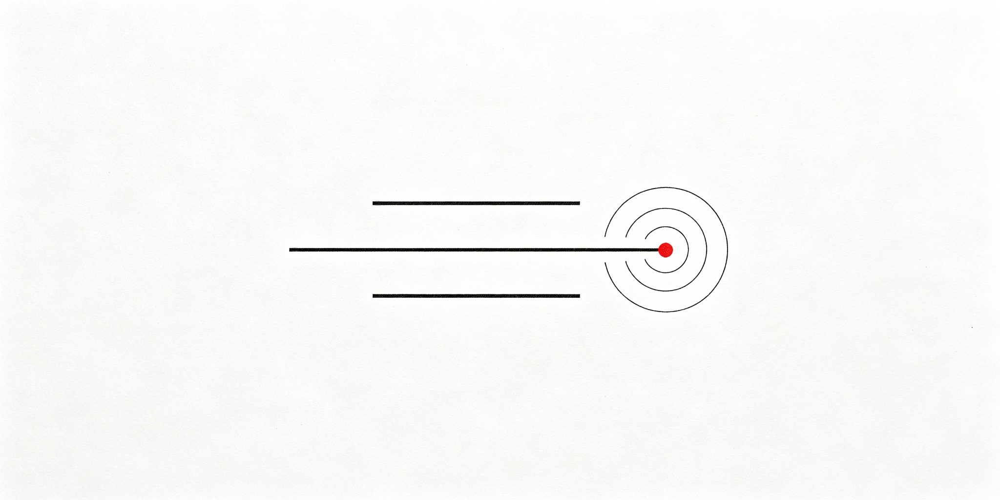

# Three Sentence Virus Skill

> **三句话病毒 Skill** —— 给 AI Agent 安装的中文传播叙事技能：三句话，让读者停不下来。

[](./three-sentence-virus/SKILL.md)
[](./three-sentence-virus/VERSION)
[](./LICENSE)



一颗螺丝，0.03 克。

一栋楼，三万吨。

工程师在电话里说，螺丝松了。

---

这不是写作课，也不是一段复制粘贴的 Prompt。这是一个可以安装到 AI Agent 中、按需自动触发的 **Skill**。

`three-sentence-virus` 通过 `SKILL.md + references/` 封装完整工作流：先判断素材事实层级，再选择心理触发器，最后生成标题、正文、可截屏金句和机制说明。它把 12 个社会心理学触发器编码成中文叙事规则：反差锚定、好奇缺口、情绪唤起、蔡格尼克留白、模因句式……输入任何素材，输出一篇让人读完、记住、想转发的长文。

它不是让模型临时“模仿一种文风”，而是为 Agent 增加一项可复用、可检查、可扩展的中文叙事能力。

## 这是一个什么 Skill

安装后，Agent 会在用户提出以下需求时按描述自动匹配或被显式调用：

- 把普通素材改成有反差、有留白的中文叙事
- 生成吸睛但不虚构事实的热点长文
- 消除 AI 腔、感悟体和过度煽情
- 提取可截屏传播的短句与标题
- 分析一篇文章使用了哪些传播心理机制

Skill 的执行结果不是固定模板，而是根据素材从 12 个触发器中选择合适组合；通常使用 5–8 个，不为展示技巧而硬凑。

## 先看一段

**普通模型写离职：**

> 走出公司大门的那一刻，我百感交集。三年的青春仿佛在身后缓缓落幕，心中充满了不舍与迷茫。

**三句话病毒写离职：**

> 前台把我的工牌剪断。
>
> 剪刀卡了两次。
>
> 她换了一把。
>
> 两把剪刀。
>
> 我一个字也没有哭。

---

**普通模型写创业失败：**

> 那是我人生中最黑暗的一天，多年的心血付诸东流，我感到前所未有的绝望。

**三句话病毒写创业失败：**

> 服务器续费通知躺在邮箱里，每月四百三十二块。
>
> 我点了取消。
>
> 页面问我确不确定。
>
> 我确定了两次。

## 为什么是"病毒"

一篇文章被转发，不是因为"写得好"，而是因为它在读者大脑里**植入了一个停不下来的循环**：

```
反差捕获注意力 → 缺口制造痒感 → 高唤起情绪驱动分享 → 留白让人难忘 → 模因句式被二次创作
```

每一个环节都有对应的心理学原理。本 Skill 把这些原理变成可执行的写作规则。

## 12 个心理触发器

| 层 | 触发器 | 心理学原理 | 它怎么下手 |
|---|---|---|---|
| 注意力 | **反差锚定** | 认知失调 · 对比效应 | 极轻与极重三句并置，大脑被迫停顿 |
| 注意力 | **好奇缺口** | 信息缺口理论 | 第三句只给关系不给答案，痒感逼人往下读 |
| 注意力 | **节奏控制** | 认知流畅性 | 短句敲击，段落留白，制造"再读一段"的惯性 |
| 情绪 | **情绪唤起** | 高唤起情绪驱动传播 | 选震惊、荒诞、心疼，避开平静与满足 |
| 情绪 | **反高潮** | 期望违背理论 | 盛大铺垫落在最日常的细节上 |
| 情绪 | **社会比较** | 社会比较理论 | 排场满足窥视，落点在钱买不到处 |
| 记忆 | **留白未完成** | 蔡格尼克效应 | 关键处沉默，不解释动机，未完成最难忘 |
| 记忆 | **具象降维** | 解释水平理论 | 用物件、数字、动作替代情绪形容词 |
| 记忆 | **回环闭合** | 格式塔闭合 · 顿悟奖赏 | 结尾回到开头但意义已变，给读者"读懂了"的奖赏 |
| 传播 | **模因句式** | 模因保真度 · 社交货币 | 设计可截屏、可套用、可二创的短句 |
| 传播 | **旁观者镜头** | 去焦点化 | 无关者的日常动作映照主线，荒诞被客观化 |
| 传播 | **元叙事掩护** | 身份信号 · 道德许可 | 文末附"本文触发了哪些心理机制"，让转发者体面 |

## 安装

把这句话发给支持 Skills 的 Agent：

```
帮我安装这个 skill：https://github.com/1Lyn-en/three-sentence-virus
```

或者把仓库里的 `three-sentence-virus` 文件夹完整复制到本机 Skills 目录：

```
~/.agents/skills/three-sentence-virus/
```

安装完成以后，屏幕不会闪。

什么都没有发生。

这是正常的。

## 使用

直接点名：

```
使用 $three-sentence-virus，把这段经历写成一篇让人停不下来的叙事。
```

也可以说人话：

```
按"三句话病毒"的写法改一下。
前三句要有反差，别煽情，让动作、数字和物件自己说话。
关键地方留白，结尾回扣开头。
```

它会输出：

1. **完整长文** —— 踩中 5-8 个心理触发器的克制叙事
2. **备选标题 ×3** —— 每个都自带好奇缺口
3. **可截屏金句 ×3-5** —— 可独立传播的模因句式
4. **触发器元说明** —— 本文用了哪些心理学机制（这是二次传播的燃料）

## 它适合

- 真实经历、人物故事、回忆录、纪实散文
- 热点事件的娱乐性叙事改写
- 创业、职场、亲情、关系故事
- 已经写满感悟，想把一半句子删掉的稿子
- 任何需要让人读完并转发的中文长文

## 它不做

- **不编数字**。记不清就写记不清，不用假精确冒充真实
- **不冒充真人**。不模仿任何在世人物的口吻或身份
- **不扩散隐私**。涉及私人生活细节时只做技法分析，不做事实搬运
- **不把网传当事实**。素材先分层，再动笔
- **不写说明文和周报**。接口没有白月光

## 仓库里有什么

```
three-sentence-virus/
├── README.md
├── LICENSE
└── three-sentence-virus/
    ├── SKILL.md              # 引擎本体，模型平时读这个
    ├── VERSION
    └── references/
        ├── triggers.md       # 12 个心理学触发器详解
        ├── style-anatomy.md  # 叙事技法拆解与原创示例
        └── safety.md         # 事实分层与安全边界
```

## 免责声明

本项目是独立的叙事技法与社会心理学研究工具，与任何公众人物无关，不代表任何个人或机构立场。它不提供任何受版权保护的原文全文，不判断任何现实事件的真假。所有示例均为原创虚构。生成内容应标注为创作或娱乐用途，不得用于捏造事实、冒充他人或侵犯隐私。

## 反馈

模型有时会复发。它会在最该沉默的时候写：

> 那一刻，我终于明白了。

看到这句，欢迎提 Issue。最好附上原始材料（可脱敏）、模型、它写出来的片段，以及它从哪一句开始替你痛彻心扉。

## 许可证

MIT
